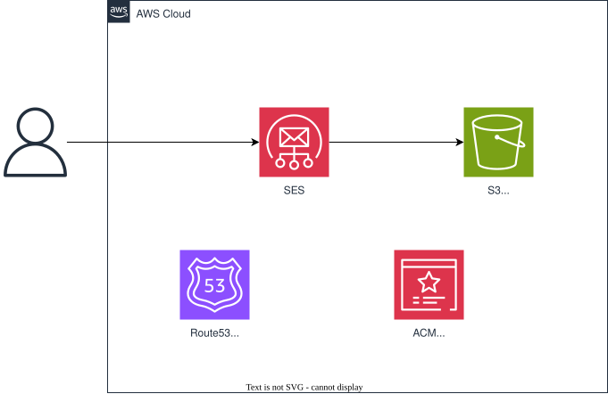

# aws-cloudformation-ses-001

## 概要

本テンプレートはSES構築用のテンプレートです。

---

## アーキテクチャ

アーキテクチャを下記に記します。

## リソース一覧

構築ディレクトリと構築するリソースを下記に記します。

| No. | ディレクトリ名   | 説明                      | 備考                                       |
| --- | ---------------- | ------------------------- | ------------------------------------------ |
| 00  | 00_hostedzone    | ホストゾーン関連          | バージニア北部に構築（コマンドに反映済み） |
| 01  | 02_s3            | S3バケット関連            | バージニア北部に構築（コマンドに反映済み   |
| 02  | 03_ses           | SES（メール）設定         |                                            |

---

## 構築手順

下記手順を参照にGitHubよりzipをダウンロードし、CloudShellにアップロードしてください。

[テンプレートアップロード手順](./upload-template.md)

その後各フォルダのReadmeを参照してください。

